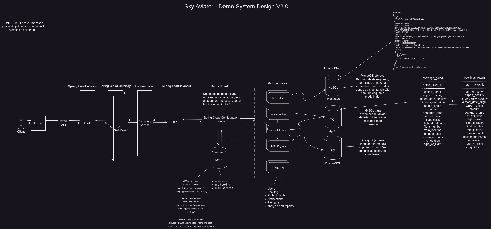
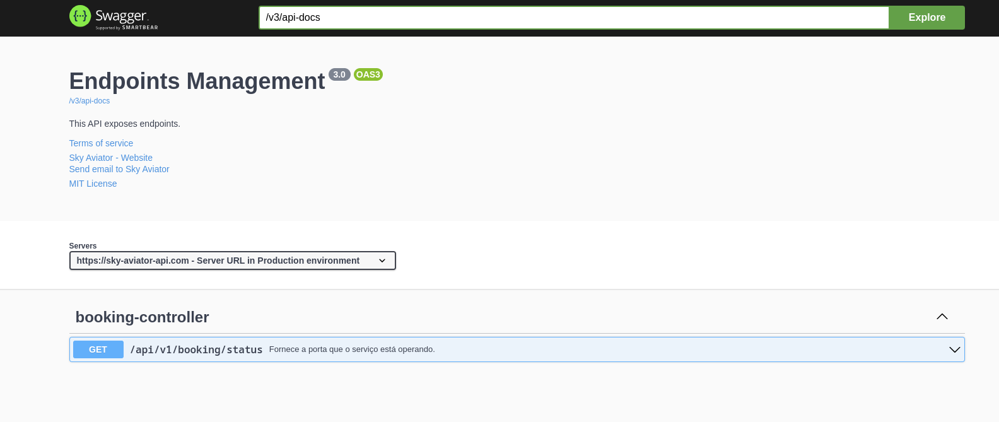
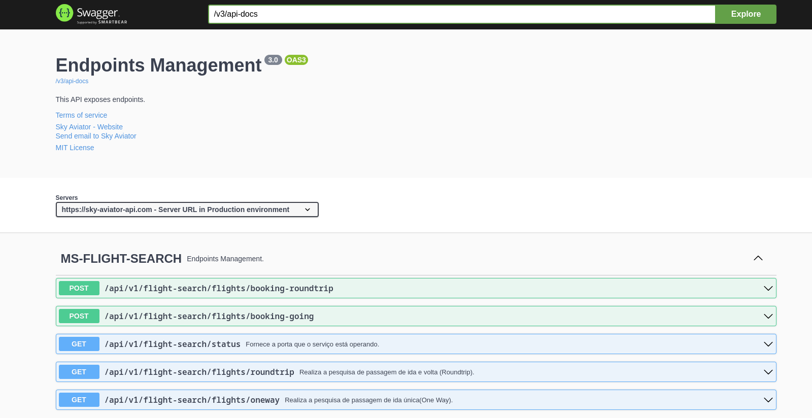

# Sky Aviator Agency.

Status: `Developing`.

## Overview:

Sky Aviator is a travel agency specializing in the sale of airline tickets. With a wide selection of destinations and partnerships with renowned airlines, we are here to make your travels unforgettable.
This backend was developed using Microservices aiming at greater scalability and independence between services. Below you can see more about the project.

## System Design - Version 2.0:

## Prerequisites:

- JDK 20
- Spring Boot 3.0.7
- Maven 3.9.2

## Technology stack:

- Java `20`
- Spring Boot `3.0.7`
- Spring Data JPA `3.1.0`
- Sonar Lint `5.1`
- Docker `24.0.2`
- MySQL `8.0.33`
- PostgreSQL `15.0`
- MongoDB `6.0`
- Redis `6.0`
- RabbitMQ `3.12.1`
- ATP Oracle `21c`
- JWT (JSON Web Tokens) `0.11.5`
- Spring Security `6.1.0`
- Spring Cloud Discovery Service `4.0.2`
- Spring Cloud Gateway `4.0.6`
- Spring Cloud LoadBalancer
- Swagger `3.0.3`

### Microservices:

| MICROSERVICES    | PORT |
| ---------------- | ---- |
| Config-Server    | 9090 |
| Api-Gateway      | 9091 |
| Eureka-Service   | 9092 |
| Ms-Users         | 9093 |
| Ms-Booking       | 9094 |
| MS-Flight-Search | 9095 |

### Database:

| Service | Host      | Port  |
| ------- | --------- | ----- |
| Redis   | localhost | 6379  |
| MySQL   | localhost | 3306  |
| MongoDB | localhost | 27017 |

### Services:

| Service  | Host      | Port |
| -------- | --------- | ---- |
| RabbitMQ | localhost | 5672 |

## Spring Cloud API Gateway:

An API Gateway is a centralized entry point for all API calls in a microservices architecture. It acts as a reverse proxy that receives requests from clients, routes them to the appropriate services, and manages the communication between clients and microservices.

The API Gateway provides several important functionalities, such as authentication, authorization, load balancing, caching, data transformation, routing, and more. It helps simplify the microservices architecture by providing a single entry point for APIs and centralizing common API management logic.

Additionally, the API Gateway also acts as a security layer, protecting the underlying microservices by exposing only authorized APIs and validating client requests.

>URI: http://localhost:9091

Register the microservices.

The route to "ms-users" microservice for example:

>URI: http://localhost:9091/ms-users/api/v1/users

This should return all registered users.

## Discovery Service:

Eureka-service is our Discovery Service.

A Discovery Service is a fundamental component in a microservices architecture. It plays the role of registering and tracking information about the available services in the infrastructure. The Discovery Service allows microservices to automatically register themselves and provide details about their location, such as IP address, port, version, etc. It also enables other services to dynamically find and access the required services without needing to know the specific location information of each service.

A famous Discovery Service is Eureka, provided by Spring Cloud Netflix. It allows services to register and discover each other using logical names, making scalability and resilience easier to achieve in a microservices architecture.

>http://localhost:9092/eureka

# Endpoints:

## Ms-Users:

"ms-users" is our user microservice;

>http://localhost:9093

### - Swagger Documentation:

>http://localhost:9093/swagger-ui/index.html

## Ms-Booking:

"ms-booking" is our booking microservice, responsible for receiving tickets from the flight search service via rabbitMQ and storing them in our database.

>http://localhost:9094

### - Swagger Documentation:

>http://localhost:9094/swagger-ui/index.html

## Ms-Flight-Search:

"ms-flight-search" is our flight search microservice, responsible for searching all available flights and sending the flights to the booking service.

>http://localhost:9095

### - Swagger Documentation:

>http://localhost:9095/swagger-ui/index.html

